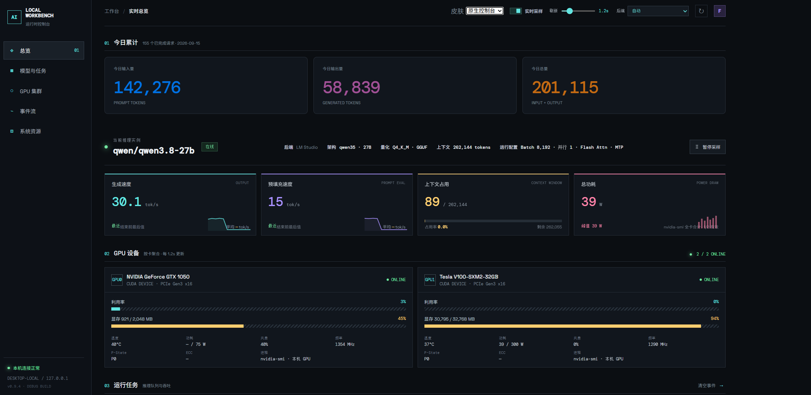
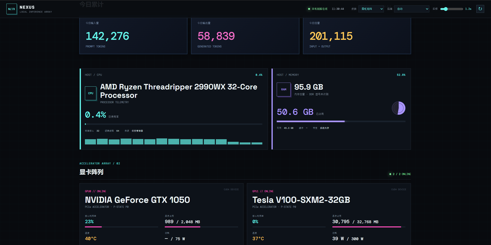
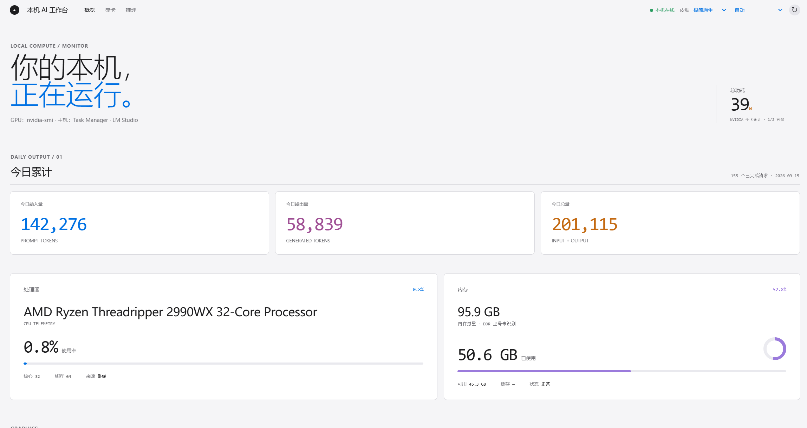
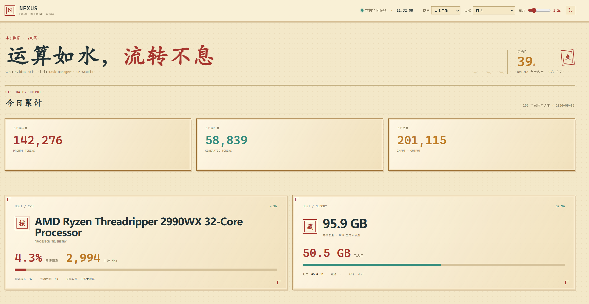

# Local AI Workbench / （老板视察喜欢的）本地AI工作台

Zero-dependency, browser-based local monitoring dashboard for GPU, token
generation speed (llama.cpp / LM Studio), power, CPU, memory, and daily
token totals.

零依赖的本地监控面板，基于浏览器运行，实时显示 GPU 状态、token 生成速度（llama.cpp / LM Studio）、功耗、CPU、内存以及每日 token 总量。

## Requirements / 环境要求

- **Node.js >= 18** – auto-installed by `scripts/start.bat` (Windows) or
  `scripts/start.sh` (macOS/Linux) if not already present.
- Optional: NVIDIA GPU + driver, llama.cpp server, or LM Studio server for
  real inference data.

  Node.js >= 18 – 若未安装，scripts/start.bat（Windows）或 scripts/start.sh（macOS/Linux）会自动安装。
可选：NVIDIA GPU + 驱动、llama.cpp 服务或 LM Studio 服务，用于获取真实推理数据。

## Install / 安装

- Simply tell your Agent I want this and copy link to it.
- 跟你的AI粘贴链接说，我要这个.

## Start / 启动方式

### Windows

```bat
scripts\start.bat
```

### macOS / Linux

```bash
bash scripts/start.sh
```

### OR ASK YOUR AI TO STARTUP IS OK / 或者问你的AI怎么启动也是可以的哦

Open <http://127.0.0.1:4173> after startup. 启动浏览器输入地址即可启动工作台。

## Skins / 皮肤

本工作台提供了4套皮肤 / 4 SKINS OFFERED IN THIS WORKBENCH 

| Skin            | EFFECT                   |
|-----------------|-----------------------|
| Native Console  |  |
| Neon Matrix     |   |
| Minimal Native  |  |
| Cloud Scroll    |   |

## Environment Variables / 环境变量

| Variable       | Default                  |
|----------------|--------------------------|
| `PORT`         | `4173`                   |
| `LLAMA_URL`    | `http://127.0.0.1:8080` |
| `LMSTUDIO_URL` | `http://127.0.0.1:1234` |

## Data Sources (priority order) / 数据来源

1. `nvidia-smi` – GPU name, utilisation, memory, temp, power, fan, P-state
2. LM Studio `server-logs/` – per-request prompt/eval tokens, daily totals
3. LM Studio `conversations/` – fallback per-conversation stats
4. llama.cpp `/metrics` or `/slots` – prompt & generation tok/s
5. Demo data – clearly labelled when no real source is reachable

The server binds to `127.0.0.1` only. No data leaves the local machine.
